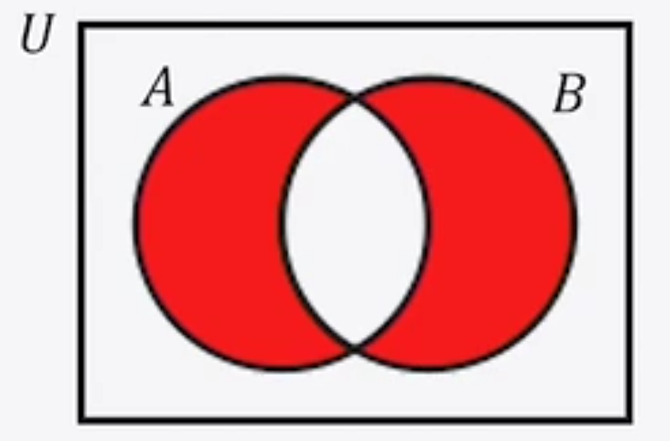

# 応用数学

## 第2章：確率統計

> 統計学1_01, 統計学1_02

### 集合とは

ものの集まりである。

数学的には、下記のように表現する。

$ S = \{a, b, c, d, e, f, g\}$
$ a \in S$

集合(S) の要素(a,b…)同士は明確に区別することができる。

集合Sの内部に、集合$M = \{c, d, g\} $があったとすると、
$ M \subset S$

集合Sに含まれないhは、
$ h \notin S$
のように区別、表現できる。

※確率・統計における「事象」は、集合として取り扱うことができる。

> 統計学1_03

共通の部分を持つ集合

- 和集合 $A \cup B$　　※A,Bのみに含まれる部分も含まれる
- 共通部分 $A \cap B$　※A,Bどちらにも含まれる部分のみ

～以外を表す集合

- 絶対補 $ U \setminus = \overline{A} $　※A以外の世界全部を表現
- 相対補 $ B \setminus A $ 　　※BからAを除いたもの

> 統計学1_04

### 問題_04

この集合を表現した式として適切な式は？

右側部分が、$ B \setminus A $　、
左側部分が、$ A \setminus B $　と表現でき、
それらの和集合であるから、
$ (B \setminus A) \cup (A \setminus B) $

> 統計学1_05

### 確率とは

- 頻度確率(客観確率)
  - 発生する頻度
  - 例：当たりくじを引く確率
- ベイズ確率(主観確率)
  - 信念の度合い
  - 例：あなたは40%の確率でインフルエンザですという診断

> 統計学1_06

### 確率の定義

$ P(A) =\frac{n(A)}{n(U)} = \frac{事象Aが起こる数}{すべての事象の数} $

※よって、確率は0～1の間の値をとる

例：
$
P(\overline{A}) = \frac{事象Aが起こらない数}{すべての事象の数}
= \frac{すべての事象の数 - 事象Aが起こる数}{すべての事象の数} \\
= \frac{n(U) - n(A)}{n(U)} \\
= \frac{n(U)}{n(U)} - \frac{n(A)}{n(U)} \\
= 1 - P(A)
$
